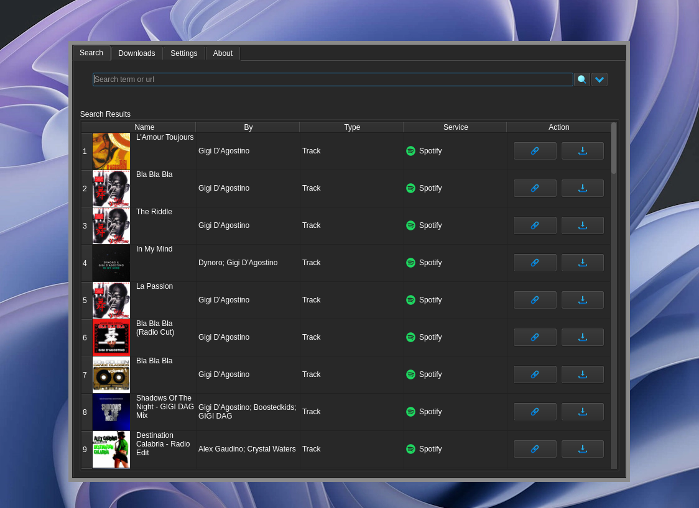
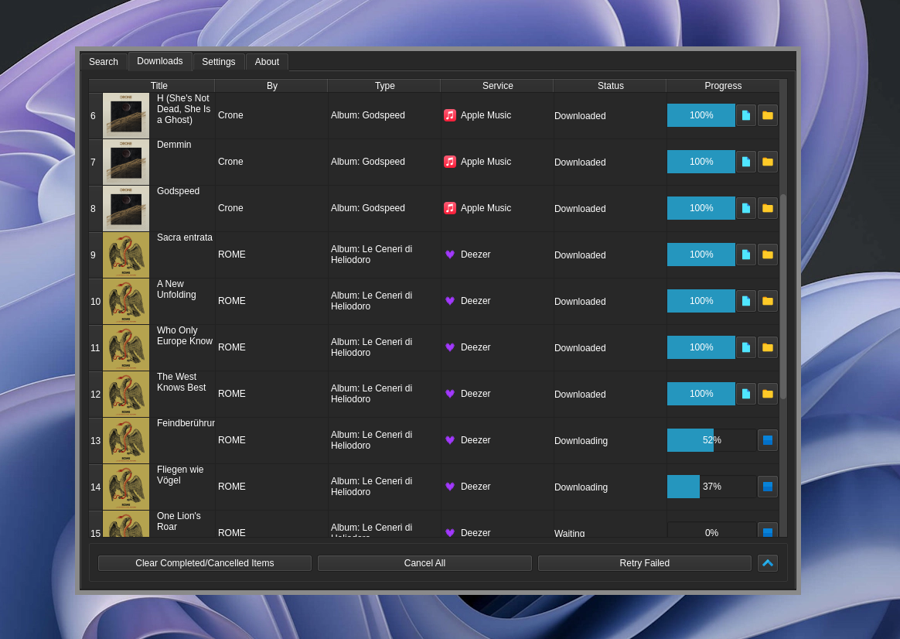
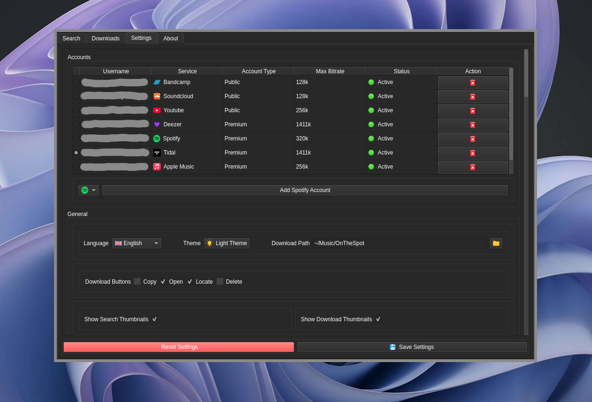

<div align="center">

<div style="text-align: center;">
  <picture>
    
  </picture>
</div>

[![Issues Badge][issues-shield]][issues-url]
[![Stars Badge][stars-shield]][stars-url]
[![Downloads Badge][downloads-shield]][downloads-url]
[![License Badge][license-shield]][license-url]

   <p>
      Welcome to OnTheSpot!
      <br />
      <a href="https://discord.gg/GCQwRBFPk9">Join Discord</a>
      ·
      <a href="https://github.com/justin025/OnTheSpot/issues/new?assignees=&labels=bug&projects=&template=bug-report.yml">Report Bug</a>
      ·
      <a href="https://github.com/justin025/OnTheSpot/issues/new?assignees=&labels=enhancement&projects=&template=feature_request.yml">Request Feature</a>
   </p>
   <br>
</div>

An easy to use music downloader written in Python. OnTheSpot has support for various music services and, unlike similar projects, downloaded files and metadata are sourced directly from the service of your choosing. The app includes a GUI, CLI, and Web UI frontend. To get started download the app [here](https://github.com/justin025/onthespot/releases/latest) or run the command below.
```bash
python3 -m pip install git+https://github.com/justin025/onthespot
```
For more further documentation, please see the following:

1. [**Installation Guide**](docs/INSTALLATION.md)
2. [**Basic Usage Instructions**](docs/USAGE.md)

> [!CAUTION]
> Currently 1 user has reported having their Spotify account locked, the account was returned to them by emailing support. This notice will be updated if any further cases come to our attention.

## Screenshots





## Need More Help?

If you have any questions or run into issues while using OnTheSpot, feel free to ask for assistance by:

- [**Opening an Issue**](https://github.com/justin025/onthespot/issues)
- [**Joining Our Discord**](https://discord.gg/GCQwRBFPk9)

## Contributing

If you encounter bugs, have suggestions, or would like to help translate the app to your native language don't hesitate to [**open an issue**](https://github.com/justin025/onthespot/issues) or submit a pull request.

## Disclaimer

OnTheSpot is intended to be used in compliance with DMCA, Section 1201, for educational, private and fair use.
OnTheSpot contributors are not responsible for any misuse of the program or source code.


For further information, please see the following [**disclaimer**](DISCLAIMER.md).

<!-- Issues Badge -->
[issues-shield]: https://img.shields.io/github/issues/justin025/onthespot?style=flat&label=Issues&labelColor=001224&color=1DB954
[issues-url]: https://github.com/justin025/onthespot/issues
<!-- Stars Badge -->
[stars-shield]: https://img.shields.io/github/stars/justin025/onthespot?style=flat&label=Stars&labelColor=001224&color=1DB954
[stars-url]: https://github.com/justin025/onthespot/stargazers
<!-- Downloads Badge -->
[downloads-shield]: https://img.shields.io/github/downloads/justin025/onthespot/total.svg?style=flat&label=Downloads&labelColor=001224&color=1DB954
[downloads-url]: https://github.com/justin025/onthespot/releases/
<!-- License Badge -->
[license-shield]: https://img.shields.io/github/license/justin025/onthespot?style=flat&label=License&labelColor=001224&color=1DB954
[license-url]: https://github.com/justin025/onthespot/blob/main/LICENSE
