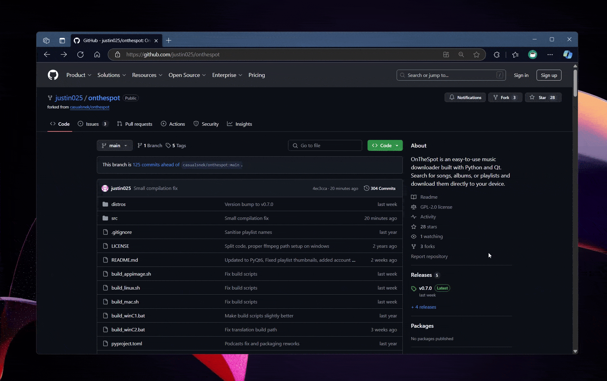

# Installation Options

## 1. Install Through Prebuilt Releases (Recommended)

This is the easiest way to get started.

1. **Download the Latest Release**

   - Visit our [GitHub Releases Page](https://github.com/justin025/onthespot/releases).
   - Look for the latest version suitable for your operating system:
     - **Windows Users**: Download the `.exe` file.
     - **MacOS Users**: Download the `.dmg` file associated with your mac (x86_64 for intel, arm64 for apple silicone).
     - **Linux Users**: Download the `.AppImage` or `tar.gz` file.

2. **Install OnTheSpot**

   - **Windows**: Run the downloaded `.exe`.
   - **MacOS**: Open the `.dmg`, follow the instructions listed in README.txt, and drag `OnTheSpot.app` into your `Applications` folder.
   - **Linux**: Make the `.AppImage` executable and run it, alternatively extract the tar.gz and execute the binary.

> [!TIP]
> For MacOS, if you encounter security warnings, right-click the app and select "Open" from the context menu to bypass the gatekeeper.

3. **Launch OnTheSpot**

   - Open the application from your Downloads folder or Applications menu.



## 2. Build The App From Source

If you prefer to build OnTheSpot yourself, follow these steps.

1. **Install Python and Download the Source Code**

   - Installing python can vary depending on your operating system.
   - The source code can be downloaded through github or through the commands below:

     ```bash
     git clone https://github.com/justin025/onthespot
     cd onthespot
     ```

2. **Run the Build Script for Your Operating System**

   - **Windows**: Open the `scripts` Folder. Double-click [`build_windows.bat`](scripts/build_windows.bat) or run it in Command Prompt.
   - **MacOS**: Run [`build_mac.sh`](scripts/build_mac.sh) in Terminal with `./scripts/build_mac.sh`.
   - **Linux**: Run [`build_linux.sh`](scripts/build_linux.sh) in Terminal with `./scripts/build_linux.sh`.
   - **Linux AppImage**: Run [`build_appimage.sh`](scripts/build_appimage.sh) in Terminal with `./scripts/build_appimage.sh`.

3. **Install and Launch OnTheSpot**

   After building the application will be located in the `dist` folder. Be sure to follow installation steps based on your operating system.


## 3. Install Via Pip or Run The App From Source
You can install the app via pip, ensure you have ffmpeg, python, and git installed in your path. Run the commands below to setup the environment:
```bash
python3 -m venv venv
source venv/bin/activate
```
Next you can download and run the app by installing via pip:
```bash
python3 -m pip install git+https://github.com/justin025/onthespot --force

onthespot-cli #cli
onthespot-gui #gui
onthespot-web #web ui
```
Alternatively you can run the app from source following the commands listed below:
```bash
git clone https://github.com/justin025/onthespot

cd onthespot/src

python3 -m onthespot.cli #cli
python3 -m onthespot.__init__ #gui
python3 -m onthespot.web #web ui
```
